#Dataviz and DH : hype or hope ? *and four other personal stories*
###by [Clement Levallois](http://www.clementlevallois.net)
###presented at the "Data Visualization for the Arts and the Humanities" event ([link](https://www.eventbrite.ie/e/data-visualization-for-the-arts-and-humanities-tickets-14880944305)), Queen's University Belfast, 05-06 March 2015

I thank the [Digital Arts and Humanities Program](http://dahphd.ie/), the [Institute for Collaborative Research in the Humanities](http://www.qub.ac.uk/research-centres/InstituteforCollaborativeResearchintheHumanities/) and Queen’s University Belfast for this invitation to speak on the topic of data visualization and the digital humanities, which I am passionate about. Preparing this talk, I realized I had many points to get across. For commodity I organized them in 5 different stories, “dataviz, hype or hope” being one of them. To share all my ideas and stay on time, I will follow a written text, which looks a bit static but I promise to add pictures like [this one](http://sharpwriter.deviantart.com/art/Welcome-to-the-Internet-Please-Follow-me-322248378) to keep you engaged and illustrate my arguments.

  

#1st story: is digital humanities + data visualization hype or hope?
This story will be a quick one. Digital humanities, data visualization: hype or hope? You can hear this one often, and this can really generate anxieties if you do digital humanities: am I just doing something superficial, is it just a fade? Well, in my opinion the “hype or hope” debate is a moot question. New cultural concepts and technologies, when they get born, seem to all undergo a cycle of hype and hope. You have this for MOOCs, big data, neuroeconomics...

This hype cycle thing is [analytical framework promoted by Gartner](http://www.gartner.com/technology/research/methodologies/hype-cycle.jsp#), which is a company specializing in market analytics:  

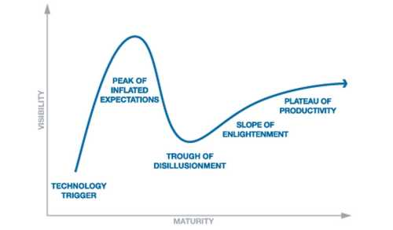
  

For big data, it gives something like this:  

- We are in the early 2000’s, the concept is quite confidential, expectations are low because basically the concept is under the radar.

- “Big data” takes off, in the late 2000’s. Journalists, vendors, consultants, professors, students in their CVs, everybody claims to be the priests of big data and the thing will basically solve everything, from the next epidemics to economic growth and global warming.

- The trough of disillusionment. Well, big data is hard, costly, and does not cure everything. Some scandals might appear, people with this skill in their CVs don’t find a job as easily as they thought…
- Slope of rationalization: heads get cooler, things calm down, expectations become more rational… That may be for the next 10 years for big data.

This is the same for the digital humanities and data visualization. We are probably in the middle of inflated expectations, fuelled by funding agencies, editors at journals… we might have the digital humanities will revolutionize / displace / transform existing scholarships. Hopefully, we will not be too disappointed and quickly reach the “plateau of productivity” …

So the moral of this story is: don’t bother too much, personally I don’t, digital humanities and dataviz are neither hype nor hope per se, they are emerging trends that will find their place in the cultural sphere just like anything else.
 
# 2nd short story: what is a good data visualization?
This one is obviously a personal story because there will be elements of a subjective judgment, and there is much room for disagreement… but here is what I think is a good data visualization.
There is a basic, minimum condition to qualify: you have to stay loyal to the data. I think it translates in three conditions:  
###**1) Fair and correct use of the visual grammar.
This data visualization illustrates my point:**  

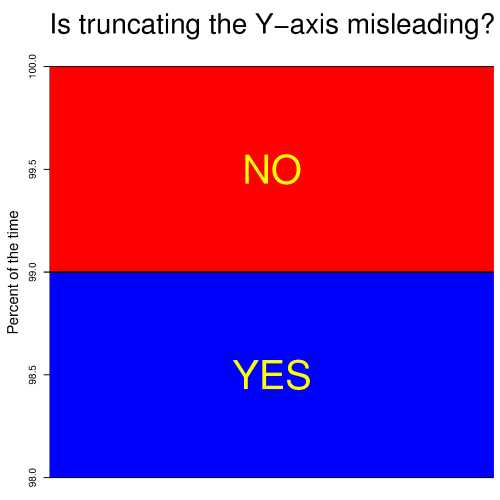
  

###**2) Intelligible.**  
Here I take the example of network visualizations. How many times do you see this kind of pictures

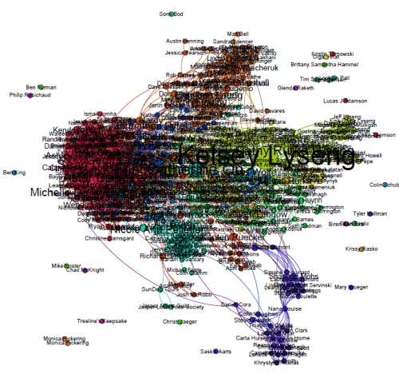
  

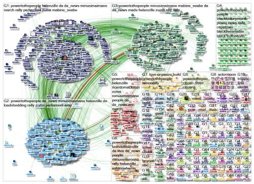
  

I suppose you with me that, no matter if the scales are correct, or if the underlying data is fairly represented, the bad design of the data visualization makes it impossible to engage with.  

###**3) No misleading rhetorical effects.**  

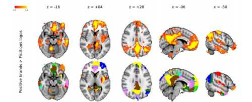
  

I take this example for neuromarketing, which is a frequent producer of a particular kind of data visualization. I observed neuromarketing in a research project in sociology of science while in Rotterdam, from 2008 to 2014. In this example you see pictures of brains representing the result of a study using fMRI, which is a type of brain scanner. 18 subjects were shown logos of brands, and the colors are supposed to represent the regions of the brain that get active when you show real brand logos, versus meaningless logos.  

This data visualization does not tell you anything about the effect of brand logos on you. But looking at the picture, it really seems that there is something to be learnt there. Wow, this is my brain when I watch logos.  

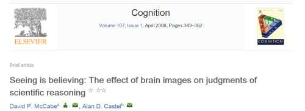
  

One study found in 2008 that [“Seeing is believing”](http://www.sciencedirect.com/science/article/pii/S0010027707002053): scientific arguments, when they are illustrated with an fMRI picture, even an irrelevant one, tended to be more persuasive than the scientific argument alone.  

Actually, that would be a nice cautionary tale, except that [another study from 2012](http://pus.sagepub.com/content/21/8/938.abstract) did not confirm this:

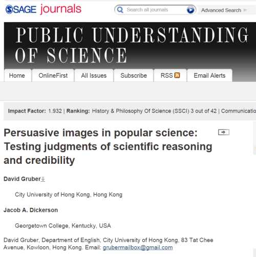
  

They suggest, I quote from the abstract, that “that images alone may not have a strong effect upon evaluation [of a text], that no image is necessarily more persuasive than another as implied by earlier studies and that further research is needed to determine what, if any, role images play in conjunction with the text to create a persuasive effect.”  

I mentioned fMRI pictures here, but the same caution is necessary with any kind of picture, and I have in mind here pictures of networks. 
If these conditions are not met, what you have in front of you might be a cartoon, or an infographics, but not a bona fide data visualization.
There is a fourth feature to characterize data visualization, but this one is less of a strict condition than a regularity that I noticed: data remains disaggregated, you often can see individual data points on data visualizations, I think this is a kind of a trademark. We should see that in the following examples.  

To me, a bad visualization is one that fails at one of these 3 conditions. What is a good data visualization now? I have some thoughts on this, and I took the occasion of this talk to spend more time on it…    

So you have these hot debates about what is a “good dataviz”, or what should be the higher goal of a dataviz… is it about teaching things to the viewer, or exploring hypotheses, or communicating results, or telling stories, or opening new worlds… To clarify all that, I’d say a couple of things:  

The dataviz has to play with the codes of its environment. Is it a dataviz for digital humanities? Or data journalism, in print or online? Is the dataviz created as a commentary on the past elections, or is it an element of advocacy for the coming elections? In each case, you will expect the dataviz to fit with the codes of the community where it will be viewed. In data journalism, dataviz might serve to help the reader understand complex factuals, with editorial guidance. The NYT and the Guardian are specialists of this ([one example here, needs to be logged in to the NYT](http://www.nytimes.com/interactive/2014/07/03/world/middleeast/syria-iraq-isis-rogue-state-along-two-rivers.html)).  

In the digital humanities, when we create dataviz, I think that we are quite lucky that we can both play on the traditional academic codes of objectivity, and engage more freely with the cultural matter that we study. I mean, I think we are more free to develop an aesthetics, and explore free forms than, say, a biologist or even a journalist would feel ok to publish. For example, Lev Manovich and Moritz Stefaner could project the result of their [study of selfies](http://selfiecity.net/) on the outside of a building!  

  

So… how to recognize a good dataviz, across domains? In digital humanities, data journalism, and beyond? In my view, there is a simple test: is it engaging? Does it get the viewer interested, absorbed? Is the dataviz memorable, are you attracted to it. Does it stick with you. To me, this data visualization, a [windmap by Hint.fm](http://hint.fm/wind/), is engaging:  

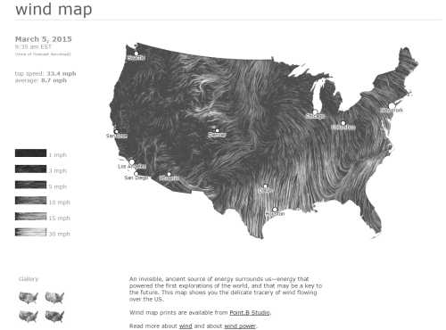
  

We want to spend time on it, we find it beautiful, the eye is drawn to different regions of the screen, and the viz suggests different questions that we did not anticipate.  

Pondering on why I was drawn to some visualizations again and again, I found that they were strong on these following “dimensions”: they used real time or recent data, they showed movement, their material was emotional, they used sound, there was a talent for telling stories, or, my personal favorite, they put esthetics on front stage (interestingly, “interaction” and “humor” are not on this list…).  

Esthetics and sound are so strong that they are in both present in the 2 pieces I’d like to share with you to conclude this story. These visualizations are connected to data in an unusual sense, it is more of generative art. Yet, they set my benchmarks when I think of my next ideal projects in dataviz: 
The first one is [Starry Night](https://vimeo.com/36466564) by Petro Vrellis from 2012 (4 minutes):  

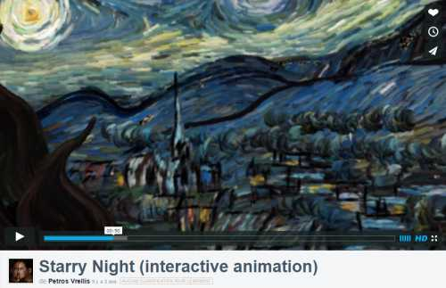
  

The second one is [“unnamed sound sculpture”](https://vimeo.com/38850289) by Daniel Franke & Cedric Kiefer with dancer Laura Keil, from 2013 (3 minutes):  

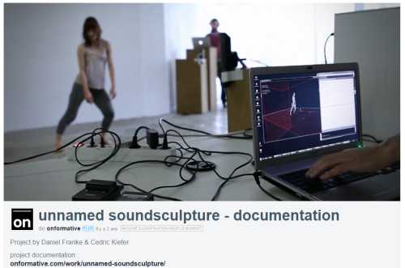
  

 
# Next story: how I came to data visualization and the digital humanities
I had finished a Phd in history of science, studying the relationships between economics and biology in post War United States.
This thesis was a contextualized history, drawing on biographies of the scientists involved and based on the cultural history of twentieth century United States. So it was very much archive based:  

  

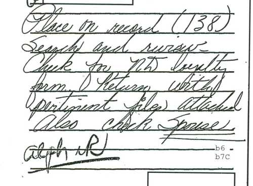
  

I visited libraries holding the personal archives of economist and peace activist Kenneth Boulding in Michigan, economist Nicholas Goergescu Roegen at Duke University, and mathematician Alfred Lotka in Princeton. Through the Freedom of Information Act, I got access to the FBI file on economist Edith Penrose. I called got rich archives from founding figures of ecology sent by the University of Akron.  
The thesis ended up being 6 chapters, 6 stories on 6 episodes of the relationship between economics and biology. It was not based on data, if we call data, [[following Wikipedia](http://en.wikipedia.org/wiki/Data):  

> « a set of values of qualitative or quantitative variables; restated, pieces of data are individual pieces of information. Data is measured, collected and reported, and analyzed, whereupon it can be visualized using graphs or images ».  

Well, actually there was just one piece of “data” in [the thesis](https://tel.archives-ouvertes.fr/tel-00372263/), and it was visualized:  

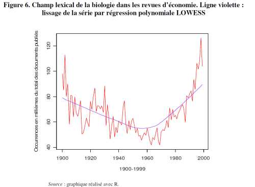
  

This was showing the number of times a term from evolutionary biology was used in economics journals throughout the twentieth century, based on counts in JStor. This was a very handy overview and confirming evidence of my main thesis:  relationships between economics and biology had decreased in intensity during the century, and had regained strength since the 1960s onwards.  
Then I moved to a postdoc position at the Rotterdam School of Management and the Virtual Knowledge Studio, where my role was to study one of the latest episodes of the relationships between economics and biology: this field I was going to observe was called “neuroeconomics”, and it studies how does decision making happens, at the level of the synapses, using neuroelectrophysiology, brain scanner studies and mathematical modeling.

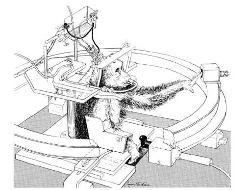
  

  

A companion field is neuromarketing, which studies how consumers process purchasing actions and advertisements – both fields had appeared ion late 90s, early 2000’s.  

So, I was once more interested in how social scientists came into contact with biologists. But this time, we were not in the distant past, we could directly ask them! So I sent a survey to all neuroeconomists with a bunch of questions…  including one asking what field they were from, and one asking “who do you work with?”  
The point was to use the answers to re-create a social network of neuroeconomists: “who is connected with whom”, and see how biologists, economists, psychologists and others were positioned in this network: do they collaborate? Are psychologists mediating the relation between economists and biologists?    
I don’t know for you, but in my case, a network evokes a visual thing, like this:  

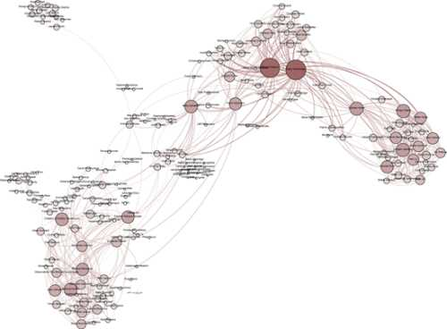
  

Maybe because I had no formal training in graph theory, which is the formal mathematical theory of networks, so I did not try to measure “clustering coefficients” or the “diameter” of the network. I just wanted to see it, I was confident I would learn things from looking at it attentively. So I must have googled “software to visualize networks” and first I found GUESS, then I found Gephi, which was just starting at the time, and that is how I started data visualization.  

So the moral of this story:  
-In 2009, I had the choice between writing a narrative based on a series of interviews from leading voices in neuroeconomics, or creating an all-encompassing view of the field where hundreds of participants (more than 600 actually), famous and anonymous, would be represented. I guess I tried the later because I thought, wow, I could grasp the entire field of neuroeconomics, worldwide, let’s see how it looks! This is what caused the shift of working with documents and narratives to a data-driven research output.  
-I did not do visualizations because I was into “data visualization”, but because I felt network data has a visual character to start with. To put it differently, since my research question was all about relationships between individuals, a visual network seemed the most exciting, insightful way to investigate it.  
 
# 4th story: digital humanities and data visualization frame the humanities as dealing with "data": is this frame wrong?  
The assumption of data visualization is, what we are doing is working on a material, that we call « data ». There is a dataset, or a corpus, or a file, or a list of records, and this is « data ». Not an argument, not a discourse, not a melody, not an incantation, not an ideology, but data. A library becomes a list of books, books become lists of pages, a page becomes a list of tokens…  

Thinking in terms of data tends to impose a quantitative view of the world…  and I think it is ok not to feel at ease with that. Because it stampedes on narrative forms of scholarschip. Let me illustrate.    
Recently, I was working on a paper on the history of neuromarketing:

  

With my co-authors Ale Smidts and Paul Wouters, we were interested in exploring the roots of neuromarketing in the academic community and in the business community, seeing if and how interactions between these communities had produced this new field.  
Since the field emerged around the 2000s, we suspected that much of the traces of this history would be digital: in blogs, online press releases, commercial websites…  

So, we hired a research assistant, Nicoline Beun, to collect all offline and online material that mentions the term « neuromarketing ». Most of it is webpages, but you also find print media, Youtube videos, slides, pictures…  

The goal was also to understand the birth and evolution of a cultural trope through its representation in all forms of media, not just print media but also blogs, Youtube videos and the rest:  

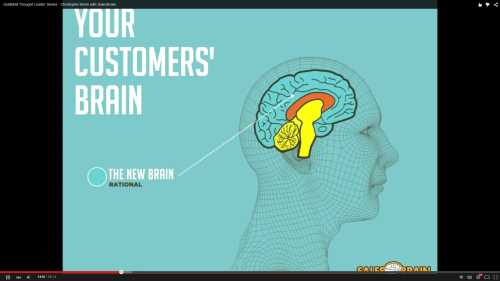
  

As surprising as it seems, this had never been done before. Nicole collected thousands of items from the first year « neuromarketing » appeared (in 2002) up to 2009.  
We ended up with something like 12 hundred documents in English, mostly web pages, and thousands of documents in other languages. This amount of documents suggested that « distant reading » was required, algorithms should be used, word frequencies should be measured, and data visualization was possible: counting terms, drawing charts showing how topics in neuromarketing were trending over the years… we did that, but that ended up being a very dry result.  

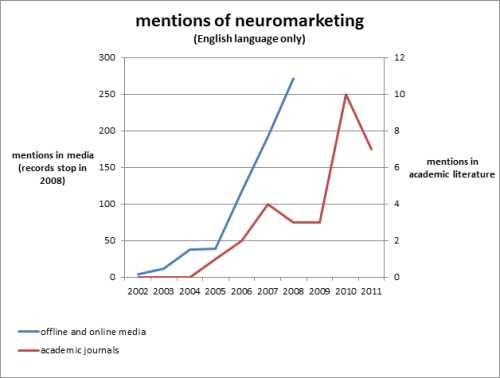
  

So … we reverted to a narrative form of argument: reading the documents, choosing which one to put forward in the paper, writing the story of the birth of neuromarketing, from early controversies to the stabilization of the field. I think this worked great, and as it is in submission, let’s hope the reviewers agree.  

Oh, and we ditched the data visualizations we had, but created a visual timeline of neuromarketing (that you can find on my website), which I find much more engaging and insightful.  

So this is the point of this story: thinking in terms of « data » and « data visualization » is a very special way of thinking which can displace equally interesting or more interesting forms of scholarship, like close reading, or historical narratives where an authorial voice is very much present… Yes the history we have written counts as “digital humanities”, since we used an empirical material that was “born digital”, but our work was not data driven in a quantitative sense. And in this case, I like it this way.  

 
# Last short story: The unintended consequences of the digital humanities
When you read about the digital humanities and data visualization, we can feel a lot of anxiety:
- What are the digital humanities, really?  
- Is digital humanities hype or hope?  
- If you are from France, you can add debates about, should it be “humanités numériques” or “humanités digitales”?  
-  How should we teach the digital humanities? To whom, at which age? In which department?  
-  Should we teach coding? (my opinion: yes we should!)  

In this story, I’d like to share more cheerful aspects of the digital humanities, which I discovered by being a member of the community and doing data visualization. I call these aspects the “unintended consequences of the digital humanities”, because they are not written on the package when you try it, and I discovered them a bit by surprise.  

###1) open source and open data: a better way to be a scholar.
I think that as scholars from the social sciences and the humanities, we are proud of our heritage and practices of scholarship. We have grand old journals which practice double blind peer-review, with rounds of reviews sending back lengthy, elaborate comments on why and how should your paper be improved before publication… we have conferences where we share the results of our research and get to discover the work by the rest of the community… I mean, that’s Robert Merton by the book.  

And then you meet engineers. I remember my surprise when they just showed me their code. That was the source code of [Gephi](http://www.gephi.org); in this case. Well, the code is there, they told me. Go, go, go, download it, the code can be used. You mean, what you created in sleepless nights, weekdays and weekends, for several years, is available for me to download and reuse? But you just published one paper on Gephi, not even a high impact factor journal! Don’t you want to hit gold before you share it? And they were: Go download the code and have fun!  

I could not help but compare with practices in my field, history of science: don’t circulate your draft too early, it might inspire somebody else before you have a chance to get your publication out! Share your archive material only with trusted friends, because archives are basically like gold mines, it is important to open them only when you have exhausted their potential for publication. And you release the results of your research when the reviewers tell you it is ready – which can be 2 to 5 years after you first submitted it, in a pay walled journal, which means that a very tiny minority of the population will ever be allowed to access it.  

I was really struck, and humbled, by the open source ethos of these computer engineers. They share their code, their data, and they release early and often. I try to align my behavior on them, and it is hard because I have this entrenched habits not to share my “precious content”. But I try to get better at it.  

###2) New forms of research output
Being a historian of science, my research outputs were expected to be the following: journal articles and book chapters. My dream was, well it still is, to publish in [ISIS](http://www.press.uchicago.edu/ucp/journals/journal/isis.html), the journal of the History of Science Society and leading journal of the field. For me, ISIS is like the Pantheon of history of science.  

But shifting to the digital humanities, things changed – a lot! Research ouputs can be oh so different. Software. Datasets.  Installations.  visualizations, blog posts. Websites, hardware, games, 3D prints... you name it. I think the digital humanities is exciting because it expands the range of ways to express ourselves, beyond the strict and sometimes narrow standards of traditional scholarship. The question of, is it fully recognized in our evaluations, is another story, but at least a wide playground has opened.  

###3)	New forms of impact
Just a note on quality and impact: it is not because you have a higher impact that your content is of a higher quality. Still, it is nice when research outputs you are proud of, get some impact, no? and I noticed that the digital humanities really help getting more impact. Just from my experience:  

[My first published paper](http://hope.dukejournals.org/content/41/1/163.abstract) is on the history of “natural selection” in mid twentieth century economic theory, and how this concept was drawn from biology (obviously) but also statistical physics. In all modesty, this the historical paper I have written that I prefer. You have a surprising twist in the plot, a smoking gun from the archives, and it even mentions missiles. Its impact? Published in 2009, it got 5 citations in 6 years. 3 of these citations are from myself. It is really sad. Nobody, or nearly nobody, reads this cool stuff. I joke about how my pride is hurt, but this is real concern.  

Ok, compare this to another research output. I created a plugin for Gephi called [“Map of countries”](https://marketplace.gephi.org/plugin/maps-of-countries/). This plugin puts a map in the background, if you have a geospatialized network, like this:  

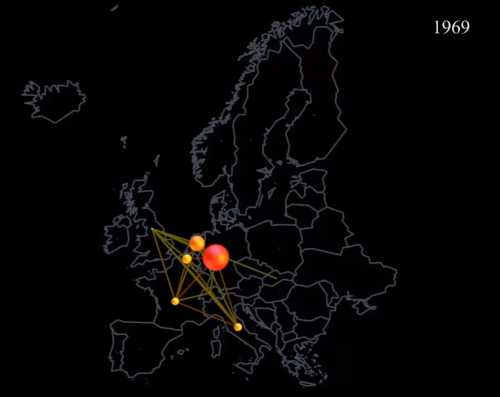
  

I created it to do the visualizations for a paper co-authored with Hubert Buch Hansen on the history of cartels in Europe. The plugin was released publicly in 2013. It got 2600 downloads in less than 2 years, and I am so happy with it. I get people asking stuff on it, and it even becomes controversial because the map of China does not include Taiwan on it. I get nice messages by email or Twitter from users who thank me for releasing this plugin and others, which helped them out in their work or research. I mean, wow.  

So the moral of this story is: doing digital humanities and data visualization feels good, it feels rewarding. But I guess you knew this one already, since you are here today.  

**That was the last of my stories, thank you.**
